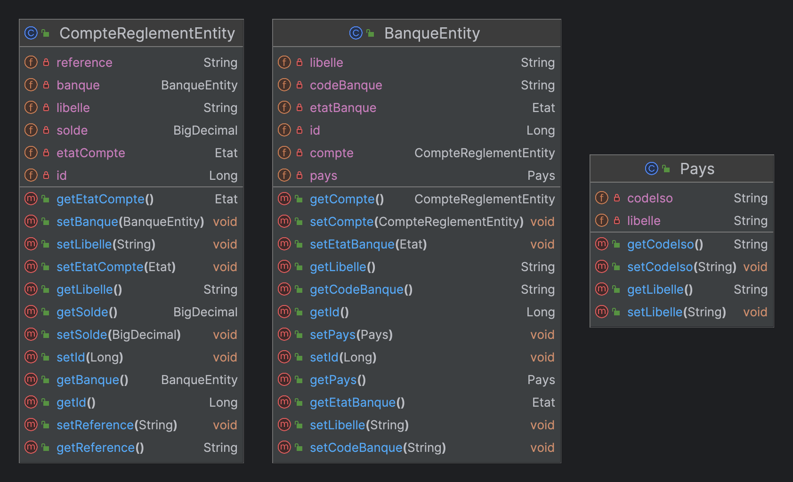

# BANQUE

Le projet Banque est un micro-service du projet global SICA

## Diagramme de classe de l'application

## Intéractions

Les microservices avec lesquels j'intéragis sont les suivants :
  - Pays : Le microservice pays mets à disposition les pays de l'union à travers les apis ci-dessous :
    - create-banque/entities/Pays

## Installation

Assurer que le serveur de config et euraka soit démarrer en deployant le docker-compose à la racine du projet.