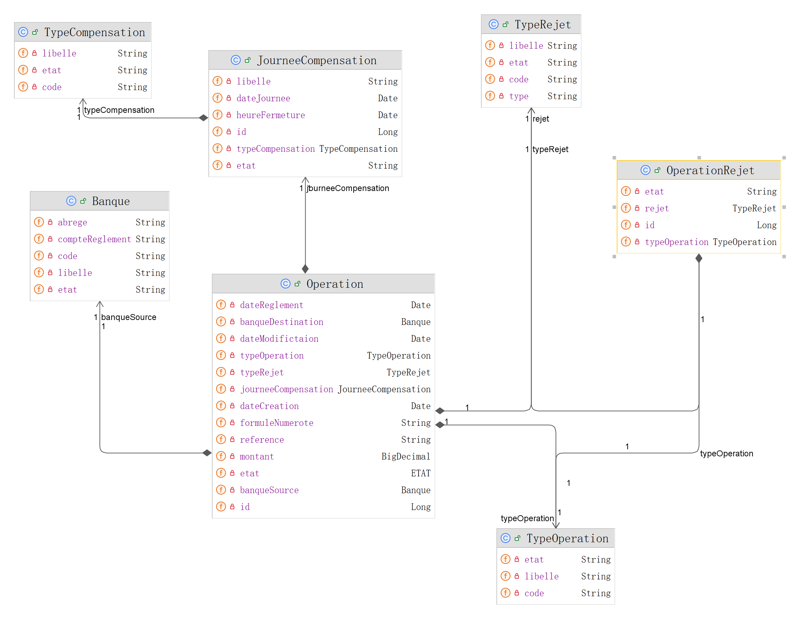

Projet micro-service operation

# OPERATIONS

Le projet Opéartions  est un micro-service du projet SICA qui traite les opérations issues des participants

## Diagramme de classe de l'application

## Les service
- TypeCompensationControlleur
    &nbsp;&nbsp;findTypeCompensationByCode()
    &nbsp;&nbsp; findAll()
    &nbsp;&nbsp; createTypeCompensation()

- JourneeCompensationController
    &nbsp;&nbsp;create()
    &nbsp;&nbsp;update()
    &nbsp;&nbsp; delete()
    &nbsp;&nbsp;ouvrirJournee()
    &nbsp;&nbsp;fermerJournee() 

- TypeRejetController
    &nbsp;&nbsp;create()
    &nbsp;&nbsp;update()
    &nbsp;&nbsp; delete()
    &nbsp;&nbsp;getTypeRejet()

- TypeOperationControlleur
    &nbsp;&nbsp;createTypeOperation()
    &nbsp;&nbsp; findAll()
    &nbsp;&nbsp; findTypeOperationByCode()

- OperationRejetController
    &nbsp;&nbsp;create()
    &nbsp;&nbsp;update()
    &nbsp;&nbsp; delete()
    &nbsp;&nbsp;getOperationRejet()

- OperationControlleur
   &nbsp;&nbsp;getAllOperation()
   &nbsp;&nbsp;findById(Long id)
   &nbsp;&nbsp;rejetOperation()
   &nbsp;&nbsp;getOperationsParJourneeCompense

## Installation

