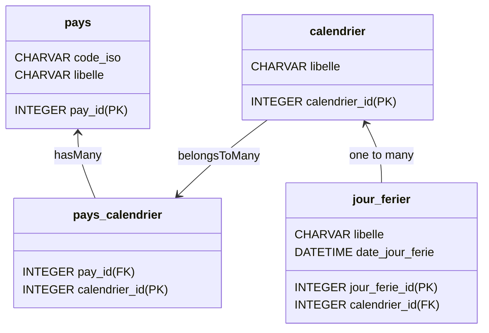

# README MICRO-SERVICE PAYS

Ce service permet de gérer une liste de pays et leurs jours fériés via un calendrier.

## User Stories

<table>
    <thead>
        <tr>
            <th>ÉPIQUE</th>
            <th>USER STORIES</th>
            <th>CRITÈRES D'ACCEPTATION</th>
        </tr>
    </thead>
     <tbody>
        <tr>
            <td rowspan=4>En tant qu'utilisateur du service Pays, je souhaite pouvoir gérer une liste de pays et leurs jours fériés via des calendriers.</td>
            <td>En tant qu'utilisateur, je devrais pouvoir créer et consulter une liste de pays pouvant être utilisés par les banques.</td>
            <td>
                Assurez-vous que l'utilisateur est capable de :
                <ul>
                    <li> récupérer un pays </li>
                    <li> obtenir une liste de pays </li>
                    <li> créer un pays</li>
                    <li> mettre à jour un pays</li>
                    <li> supprimer un pays</li>
                </ul>
            </td>
        </tr>
        <tr>
            <td>En tant qu'utilisateur, je devrais pouvoir créer un calendrier pour regrouper les jours fériés</td>
            <td>
                Assurez-vous que l'utilisateur est capable de :
                <ul>
                    <li> récupérer un ... </li>
                    <li> obtenir une liste de ... </li>
                    <li> créer un ...</li>
                    <li> mettre à jour ...</li>
                    <li> supprimer ....</li>
                </ul>
            </td>
        </tr>
        <tr>
            <td>En tant qu'utilisateur, je souhaite pouvoir conserver une liste de jours fériés à ajouter aux calendriers.</td>
            <td>
                Assurez-vous que l'utilisateur est capable de :
                <ul>
                    <li> ajouter un jour férié </li>
                    <li> obtenir une liste de pays</li>
                    <li> créer un pays</li>
                    <li> mettre à jour un pays</li>
                    <li> supprimer un pays</li>
                </ul>
            </td>
        </tr>
    </tbody>
</table>

## Domaine du Service

## SERVICE OPERATIONS

### PaysService

- getPays ()
- getAllPays ()
- addPays ()
- updatePays ()
- deletePays ()
- isFerier ()

### CalendrierService

- getCalendrier ()
- getAllCalendrier ()
- addCalendrier ()
- updateCalendrier ()
- deleteCalendrier ()

### JourFerierService

- getJourFerier ()
- getAllJourFerier ()
- addJourFerier ()
- updateJourFerier ()
- deleteJourFerier ()
- 

