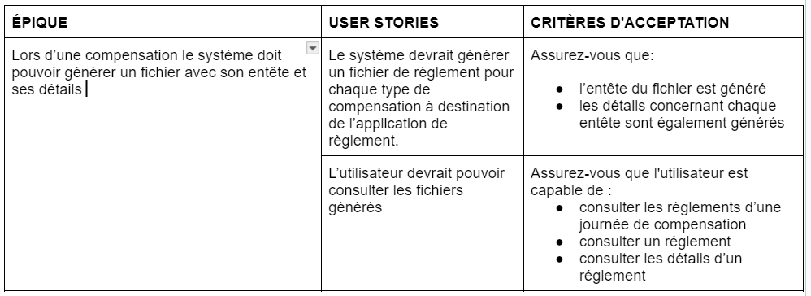
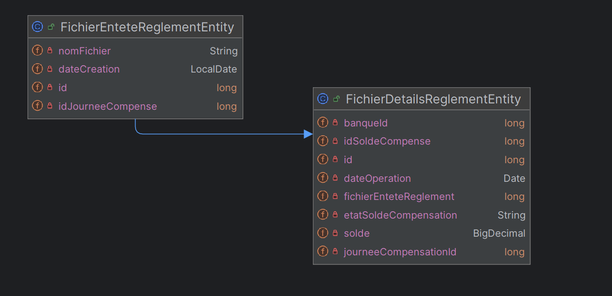

README MICRO-SERVICE REGLEMENT

Ce service fait la génération des fichiers dans une journée de compensation

USER STORIES

DOMAINE DU SERVICE

SERVICE OPERATIONS

getDetailsReglementByIdReglement(long id)
getAll()
createReglement(SoldeCompensationDTO[] soldeCompensations)
updateReglement( long id, FichierEnteteReglementDTO reglementDTO)
getReglementById( long id)
deleteReglement(long id)
getReglementByJourneeCompensation(long id)

